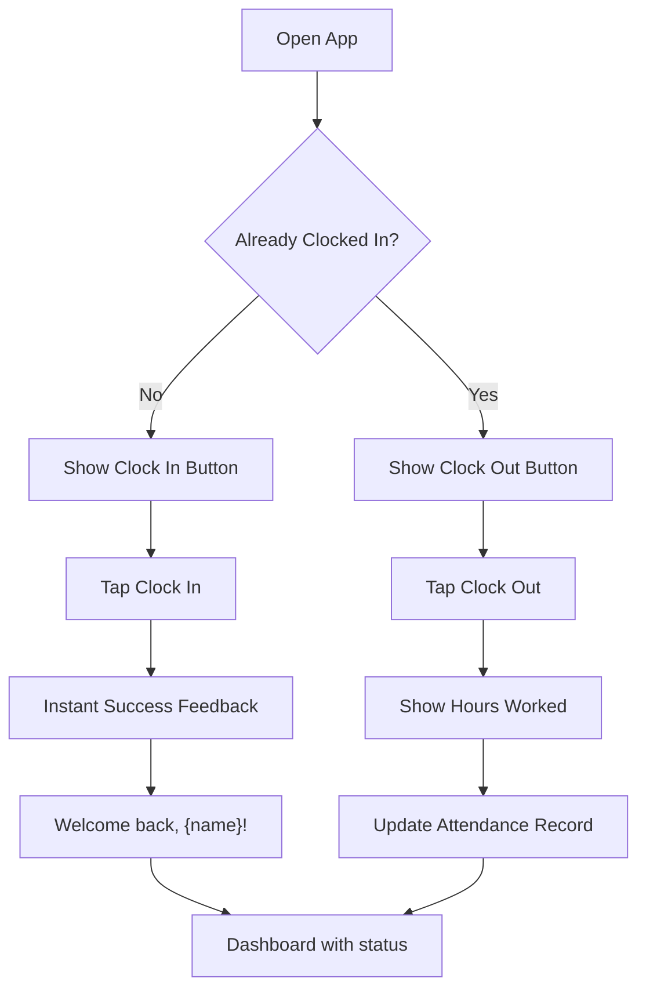
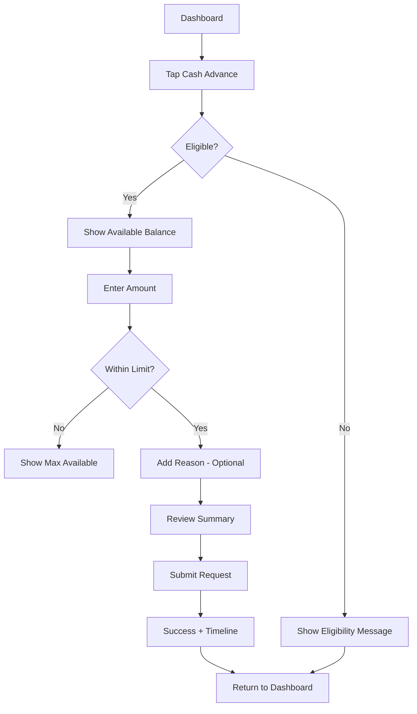
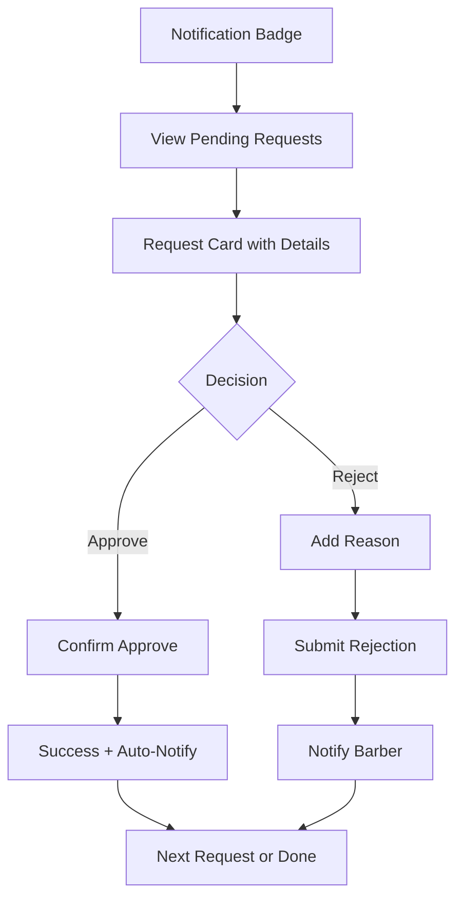
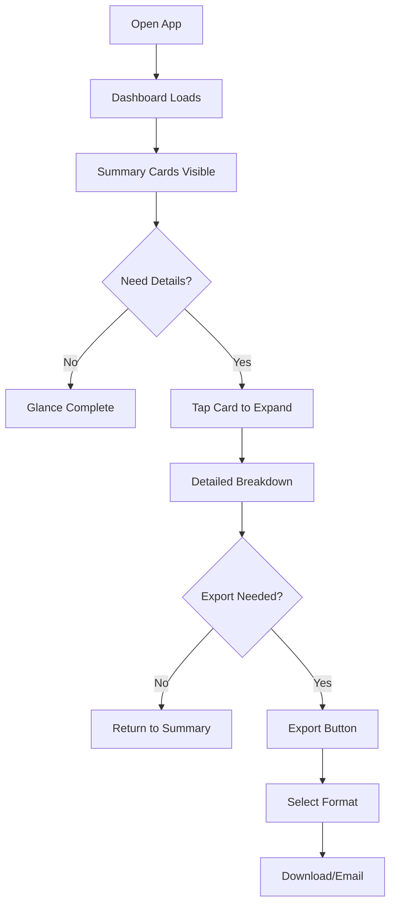
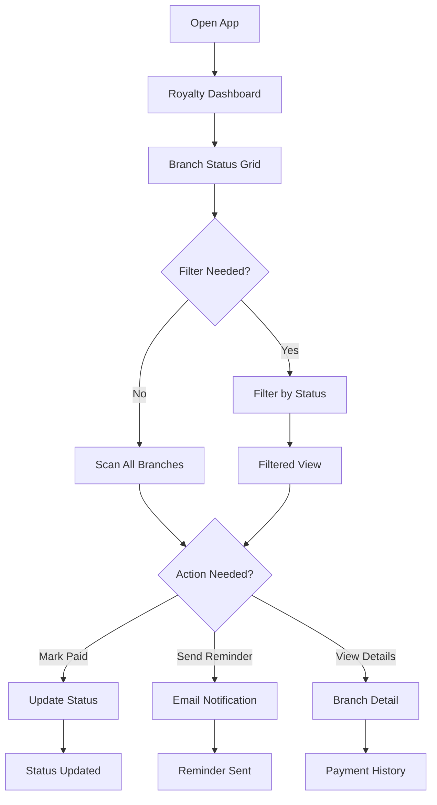

# UX Design Specification - tpx-booking-app

**Author:** MASTERPAINTER
**Date:** 2026-01-25

---

## Executive Summary

### Project Vision

TPX Booking App enhancement to transform from a booking-focused system into a comprehensive franchise management platform. The UX must integrate 5 new capabilities (Accounting, Royalty, Cash Advance, Product Catalog, Time Tracking) into the existing dashboard without disrupting current user workflows.

### Target Users

| User Type | Context | UX Needs |
|-----------|---------|----------|
| **Super Admin** | Business owner, strategic view | Dashboard showing all branches at once, quick royalty status, bulk actions |
| **Branch Admin** | Franchisee, operational focus | P&L at a glance, easy approvals, minimal clicks for daily tasks |
| **Barber** | Employee, mobile-first | Simple cash advance request, instant time clock, clear payroll visibility |

### Key Design Challenges

1. **Role-Based Navigation** - Different users need different primary actions surfaced
2. **Financial Clarity** - P&L data must be scannable by non-accountants
3. **Approval Flow UX** - Cash advances need clear status and fast approval
4. **Mobile-First Constraints** - All features must work on mobile (existing Capacitor setup)

### Design Opportunities

1. **Glanceable Financial Health** - Summary cards showing key metrics upfront
2. **One-Tap Workflows** - Minimize clicks for frequent actions (time clock, approvals)
3. **Consistent Status Language** - Same visual patterns across all features
4. **Smart Progressive Disclosure** - Show summary first, details on demand

## Core User Experience

### Defining Experience

**Primary Experience by Role:**
- **Barber:** Instant time clock + simple cash advance requests
- **Branch Admin:** Financial clarity + fast approvals
- **Super Admin:** Multi-branch visibility + centralized control

### Platform Strategy

| Platform | Primary Users | Optimization |
|----------|--------------|--------------|
| Mobile (iOS/Android) | Barbers, Branch Admins on-the-go | Touch-first, large tap targets |
| Desktop Web | Super Admin, Branch Admins for reporting | Data-dense views, keyboard shortcuts |

**Technical Foundation:** Existing React 19 + Capacitor stack. New features follow established patterns.

### Effortless Interactions

| Feature | Target Interaction Time | UX Goal |
|---------|------------------------|---------|
| Time In/Out | < 2 seconds | One tap, no confirmation |
| Cash Advance Approval | < 5 seconds | View → Decide → Done |
| P&L Summary | Instant on load | No navigation to see key numbers |
| Royalty Status Check | Instant on load | All branches visible at once |

### Critical Success Moments

1. **Branch Admin sees profit at a glance** - First dashboard view shows net income prominently
2. **Barber gets cash advance approved** - Clear notification with expected timeline
3. **Super Admin tracks all royalties** - Single view shows who paid, who didn't
4. **Month-end export works** - CSV/PDF download in 2 clicks for BIR compliance

### Experience Principles

1. **Glanceable First** - Answer before the question. Summary visible, details on demand.
2. **One-Tap Core Actions** - Minimize friction for frequent tasks
3. **Role-Appropriate Density** - Right amount of info for each user type
4. **Consistent Status Language** - Same colors and patterns across all features
5. **Mobile-Native Feel** - Touch-friendly even on desktop

## Desired Emotional Response

### Primary Emotional Goals

| Role | Primary Emotion | UX Driver |
|------|-----------------|-----------|
| **Super Admin** | Confident & In Control | Full visibility across all branches |
| **Branch Admin** | Empowered & Informed | Clear financial picture, fast actions |
| **Barber** | Supported & Respected | Dignified processes, valued as team member |

### Emotional Journey Mapping

| Stage | Emotion | Design Support |
|-------|---------|----------------|
| First View | Clarity | Key metrics immediately visible |
| Core Action | Confidence | Clear feedback, instant results |
| Task Complete | Accomplishment | Confirmation, success indicators |
| Error State | Calm | Clear recovery path, no blame |

### Micro-Emotions

**Amplify:** Confidence, Trust, Accomplishment, Relief
**Prevent:** Confusion, Embarrassment, Anxiety, Frustration

### Design Implications

- **Cash Advance:** Private, dignified flow - no interrogation or judgment language
- **P&L Dashboard:** Informative but not alarming - celebrate wins, note concerns calmly
- **Royalty Tracking:** Organized, professional - status board not chase list
- **Time Clock:** Welcoming, acknowledging - "Welcome back, Carlos" not just a button

### Emotional Design Principles

1. **Information, Not Alarm** - Present data clearly without creating anxiety
2. **Dignity in All Flows** - Every user interaction should feel respectful
3. **Celebrate Efficiency** - Quick completion should feel rewarding
4. **Trust Through Transparency** - Show the calculation, not just the result

## UX Pattern Analysis & Inspiration

### Inspiring Products Analysis

| Feature Area | Reference Apps | Key Pattern |
|--------------|----------------|-------------|
| Financial Dashboard | Wave, QuickBooks | Summary cards, clear profit indicators |
| Time Tracking | Deputy, Homebase | One-tap clock, shift visibility |
| Approvals | Slack, Gusto | Swipe actions, notification-driven |
| Product Catalog | Square, Shopify | Grid view, image-forward, quick edit |
| Payment Status | Stripe Dashboard | Traffic light status, aging indicators |

### Transferable UX Patterns

**Adopt:**
- Summary cards for financial data (Wave pattern)
- Traffic light status colors (universal)
- Big tap targets for primary actions (Deputy pattern)
- Pull-to-refresh for data updates

**Adapt:**
- Swipe-to-approve for cash advance (Slack-inspired)
- Bottom tab navigation (role-specific)

### Anti-Patterns to Avoid

- Confirmation dialogs for frequent actions (use undo instead)
- Dense financial tables on mobile (use expandable cards)
- Hidden export options (make BIR export prominent)
- Approval flows buried in menus (use notifications + quick actions)

### Design Inspiration Strategy

Focus on proven patterns from apps users already know. Prioritize familiarity and speed over novelty. New features should feel like natural extensions of the existing TPX experience.

## Design System Foundation

### Design System Choice

**Primary:** TailwindCSS 4 (existing)
**Component Library:** shadcn/ui (Tailwind-native, copy-paste components)
**Charting:** Recharts (if P&L visualization needed)

### Rationale for Selection

1. **Brownfield Constraint** - Must match existing UI patterns
2. **Timeline** - 1 week requires leveraging existing foundation
3. **Consistency** - shadcn/ui is Tailwind-native, no paradigm shift
4. **Flexibility** - Copy-paste approach means full customization control

### Implementation Approach

| New Feature | UI Components Needed |
|-------------|---------------------|
| Accounting/P&L | Summary cards, data table, export buttons |
| Royalty | Status dashboard, config form, receipt display |
| Cash Advance | Request form, approval cards, status badges |
| Product Catalog | Grid/list view, product cards, edit modal |
| Time Tracking | Clock button, attendance table, date picker |

### Customization Strategy

**Design Tokens (CSS Variables):**
- `--color-success`: Green (#22c55e) - Paid, Approved, Clocked In
- `--color-warning`: Yellow (#eab308) - Pending, Due Soon
- `--color-danger`: Red (#ef4444) - Overdue, Rejected
- `--color-neutral`: Gray (#6b7280) - Inactive states

**Typography:**
- Headlines: Bold, larger for key metrics (₱185,000)
- Labels: Muted, smaller for context (Total Revenue)
- Body: Regular for descriptions

## Defining Experience

### Role-Based Defining Experiences

| Role | Defining Experience | Success Criteria |
|------|---------------------|------------------|
| **Barber** | One-tap time clock | < 2 seconds to clock in |
| **Branch Admin** | Instant financial clarity | Key metrics visible immediately |
| **Super Admin** | All branches, one view | Complete royalty status at a glance |

### User Mental Models

**Barber:** Expects instant, no-fuss time tracking. Used to punch clocks or paper sign-in. Delighted by "just works."

**Branch Admin:** Expects clarity without complexity. Used to Excel spreadsheets and end-of-month chaos. Delighted by answering questions fast.

**Super Admin:** Expects control and visibility. Used to calling branches and chasing payments manually. Delighted by knowing status without asking.

### Success Criteria

| Experience | Target | Measurement |
|------------|--------|-------------|
| Time Clock | < 2 seconds from app open to clocked in | Timer |
| P&L View | Key numbers visible without scrolling | Viewport test |
| Royalty Dashboard | All branches visible without pagination | Viewport test |
| Cash Advance Request | Submit in < 30 seconds | Timer |
| Approval Action | Complete in < 5 seconds | Timer |

### Pattern Strategy

**100% Established Patterns** - No novel interactions. Users should feel immediately familiar with every feature. Speed over innovation for 1-week timeline.

### Experience Mechanics

Each core interaction follows: **Initiation → Interaction → Feedback → Completion** with clear visual feedback at every step. No confirmation dialogs for frequent actions (use undo instead).

## Visual Design Foundation

### Color System

**Existing Brand Palette (Preserve):**

| Token | Value | Usage |
|-------|-------|-------|
| `--color-primary` | #FF8C42 | Primary brand, buttons, highlights |
| `--color-accent` | #FF7A2B | Interactive elements, hover states |
| `--color-bg` | #0A0A0A | Main background (dark theme) |
| `--color-text` | #FFFFFF | Primary text |
| `--color-muted` | #333333 | Secondary backgrounds, borders |

**New Semantic Colors (Financial Features):**

| Token | Value | Usage |
|-------|-------|-------|
| `--color-success` | #22c55e | Paid, Approved, Clocked In |
| `--color-warning` | #eab308 | Pending, Due Soon |
| `--color-danger` | #ef4444 | Overdue, Rejected, Errors |
| `--color-neutral` | #6b7280 | Inactive, Disabled states |

**Color Application Rules:**
- Status indicators use traffic light pattern (green/yellow/red)
- Financial numbers: Positive in white, Negative in `--color-danger`
- Branch Admin sees P&L in high contrast for scanability
- Consistent status colors across all new features

### Typography System

**Type Scale (Tailwind Defaults + Extensions):**

| Element | Class | Usage |
|---------|-------|-------|
| **Metric Display** | `text-3xl font-bold` | Key financial numbers (₱185,000) |
| **Section Heading** | `text-xl font-semibold` | Feature titles, card headers |
| **Card Title** | `text-lg font-medium` | Individual item titles |
| **Body Text** | `text-base` | Descriptions, content |
| **Label/Caption** | `text-sm text-gray-400` | Field labels, timestamps |
| **Badge/Status** | `text-xs font-medium` | Status indicators |

**Typography Principles:**
- Big, bold numbers for financial data (Branch Admin scanability)
- Muted labels beneath values (context without clutter)
- Consistent weight hierarchy: bold → semibold → medium → regular

### Spacing & Layout Foundation

**Spacing Scale (8px Base):**

| Token | Value | Usage |
|-------|-------|-------|
| `space-1` | 4px | Tight spacing, badge padding |
| `space-2` | 8px | Default element gap |
| `space-3` | 12px | Card internal padding |
| `space-4` | 16px | Section gaps |
| `space-6` | 24px | Major section separation |
| `space-8` | 32px | Page-level margins |

**Layout Principles:**
1. **Cards over Tables** - Financial data in summary cards, expandable for detail
2. **Bottom Navigation** - Role-specific tabs for mobile (existing pattern)
3. **44px Touch Targets** - All interactive elements (already implemented)
4. **Safe Areas** - iOS notch support (already implemented)

**Grid Strategy:**
- Mobile: Single column, full-width cards
- Desktop: 2-3 column grid for dashboards
- Summary cards: Equal width in row, responsive stack on mobile

### Accessibility Considerations

**Contrast Requirements:**
- All text meets WCAG AA (4.5:1 minimum)
- Orange on dark background: Verified
- Status colors tested against dark backgrounds

**Mobile Accessibility:**
- Minimum 44px touch targets (enforced via CSS)
- 16px minimum font for form inputs (iOS zoom prevention)
- Focus states use orange highlight ring

**Color Independence:**
- Status indicators include icons, not just color
- Financial trends include ↑/↓ arrows alongside color
- Never rely on color alone for meaning

## Design Direction Decision

### Design Directions Explored

**Brownfield Constraint Acknowledged:** TPX Booking App has an established visual identity. New features (Accounting, Royalty, Cash Advance, Product Catalog, Time Tracking) must integrate seamlessly rather than introducing competing aesthetics.

**Direction Explored: Unified Extension**
- Extend existing card-based layouts for financial data
- Apply traffic light status colors within dark theme context
- Use established component patterns from current app
- Maintain mobile-first responsive approach

### Chosen Direction

**Direction: Integrated Financial Dashboard Style**

| Feature | Visual Approach |
|---------|----------------|
| **P&L Dashboard** | Summary cards with large metric displays, expandable for detail |
| **Royalty Tracking** | Branch status grid with traffic light indicators |
| **Cash Advance** | Card-based request/approval flow with clear status badges |
| **Product Catalog** | Grid view with product cards, matching existing layouts |
| **Time Clock** | Prominent clock-in button, minimal UI, instant feedback |

**Key Visual Elements:**
- **Summary Cards:** Dark background (`#1a1a1a`), white text, orange accent borders
- **Status Badges:** Pill-shaped, semantic colors (green/yellow/red)
- **Metric Display:** `text-3xl font-bold` for key numbers
- **Action Buttons:** Orange fill for primary, ghost for secondary
- **Tables:** Dark striped rows, minimal borders, expandable on mobile

### Design Rationale

1. **Consistency Over Novelty:** Users already know the TPX interface. New features should feel native, not "bolted on."

2. **1-Week Timeline:** No time for user learning curve. Familiar patterns reduce friction.

3. **Role Optimization:**
   - Barbers get large touch targets and minimal UI
   - Branch Admins get scannable financial data
   - Super Admins get dense multi-branch views

4. **Emotional Alignment:** Dark theme with orange feels premium and professional - appropriate for financial features.

### Implementation Approach

**Component Strategy:**

| Component | Source | Customization |
|-----------|--------|---------------|
| Summary Card | shadcn/ui Card | Dark variant + orange accent |
| Data Table | shadcn/ui Table | Dark striped rows |
| Status Badge | shadcn/ui Badge | Semantic color variants |
| Form Inputs | Existing TPX inputs | No changes needed |
| Buttons | Existing TPX buttons | No changes needed |
| Modal/Dialog | shadcn/ui Dialog | Dark variant |

**No HTML Mockup Generated:** Given brownfield constraints and established visual system, detailed mockups would duplicate existing patterns. Implementation should reference current app components directly.

## User Journey Flows

### Time Clock Journey (Barber)

**Goal:** Clock in/out in < 2 seconds

**Entry Point:** App open → Dashboard



**Key UX Decisions:**
- No confirmation dialog - single tap action
- Instant visual feedback (green checkmark animation)
- Personalized greeting creates emotional connection
- Hours worked visible immediately after clock out

### Cash Advance Request Journey (Barber)

**Goal:** Submit request in < 30 seconds



**Key UX Decisions:**
- Eligibility check upfront (no wasted time)
- Available balance shown clearly
- Reason field optional (dignified, not interrogation)
- Clear timeline expectation set on submission

### Cash Advance Approval Journey (Branch Admin)

**Goal:** Approve/reject in < 5 seconds



**Key UX Decisions:**
- Notification-driven (don't hunt for approvals)
- All info visible on card (no drill-down needed)
- Swipe gesture optional for quick action
- Rejection requires reason (accountability)

### P&L Dashboard Journey (Branch Admin)

**Goal:** Key metrics visible without scrolling



**Key UX Decisions:**
- Three summary cards above fold: Revenue, Expenses, Net Income
- Tap to expand for line-item detail
- Export in 2 clicks (BIR compliance)
- Period selector prominent (MTD, Last Month, Custom)

### Royalty Tracking Journey (Super Admin)

**Goal:** All branches visible at a glance



**Key UX Decisions:**
- All branches visible without pagination
- Traffic light status (green/yellow/red)
- Bulk actions for efficiency
- One-click reminder emails

### Journey Patterns

**Navigation Patterns:**
- Bottom tab for primary navigation (role-specific tabs)
- Back button always available
- Breadcrumbs on detail views

**Decision Patterns:**
- Binary decisions get buttons side-by-side
- Multi-option uses dropdown or modal
- Destructive actions require confirmation

**Feedback Patterns:**
- Instant visual feedback (< 100ms)
- Success: Green checkmark + brief message
- Error: Red highlight + recovery action
- Loading: Skeleton screens, not spinners

### Flow Optimization Principles

1. **Zero-Friction Core Actions:** Time clock and approvals have no confirmation dialogs
2. **Smart Defaults:** Period defaults to current month, amounts to typical values
3. **Progressive Disclosure:** Summary first, detail on demand
4. **Error Prevention:** Validate before submit, show limits upfront
5. **Recovery Paths:** Every error state has a clear "fix it" action

## Component Strategy

### Design System Components

**Foundation (shadcn/ui - Dark Variant):**

| Component | Usage | Customization |
|-----------|-------|---------------|
| Card | Container for all feature sections | Dark bg, orange accent border |
| Button | Primary/secondary actions | Orange fill / Ghost variant |
| Badge | Status indicators | Semantic color variants |
| Table | Data lists (attendance, transactions) | Striped dark rows |
| Dialog | Modals for forms and confirmations | Dark overlay |
| Tabs | Feature navigation within pages | Orange active indicator |
| Input/Select | All form fields | Dark variant, orange focus |
| Toast | Success/error notifications | Semantic colors |

**Existing TPX Components (Reuse):**
- Navigation (bottom tabs, header)
- User Avatar
- Date Picker (react-datepicker)
- Loading states

### Custom Components

#### MetricCard

**Purpose:** Display key financial metrics (Revenue, Expenses, Net Income)

**Anatomy:**
```
┌─────────────────────────┐
│ Label (muted)           │
│ ₱185,000 (bold, large)  │
│ ↑ 12% vs last month     │
└─────────────────────────┘
```

**Props:**
- `label`: string (e.g., "Total Revenue")
- `value`: number (formatted as currency)
- `trend`: { direction: 'up' | 'down' | 'flat', percentage: number }
- `onClick`: optional expand handler

**States:** Default, Hover (subtle lift), Loading (skeleton)

**Accessibility:** `role="figure"`, `aria-label` with full metric description

---

#### StatusBadge

**Purpose:** Consistent status indicators across all features

**Variants:**

| Status | Color | Icon | Usage |
|--------|-------|------|-------|
| `paid` / `approved` / `clocked_in` | Green | ✓ | Positive completion |
| `pending` / `due_soon` | Yellow | ⏳ | Awaiting action |
| `overdue` / `rejected` | Red | ✗ | Needs attention |
| `inactive` / `draft` | Gray | — | Neutral state |

**Props:**
- `status`: StatusType
- `size`: 'sm' | 'md' (default: 'md')

**Accessibility:** Icon + text, never color alone

---

#### ClockButton

**Purpose:** One-tap time clock with instant feedback

**Anatomy:**
```
┌─────────────────────────────┐
│     [Large circular tap]    │
│         CLOCK IN            │
│      or CLOCK OUT           │
│                             │
│    Current: 4h 32m worked   │
└─────────────────────────────┘
```

**States:**
- `clocked_out`: Orange "Clock In" button
- `clocked_in`: Green "Clock Out" button with timer
- `loading`: Pulsing animation during API call
- `success`: Brief checkmark animation

**Props:**
- `status`: 'clocked_in' | 'clocked_out'
- `hoursWorked`: number (optional, for clocked_in state)
- `onToggle`: () => void

**Accessibility:** `aria-pressed` for toggle state, `aria-live` for status changes

---

#### ApprovalCard

**Purpose:** Cash advance request display for Branch Admin approval

**Anatomy:**
```
┌─────────────────────────────────┐
│ [Avatar] Carlos Reyes           │
│ Requested: ₱2,000               │
│ Available Balance: ₱5,000       │
│ Reason: Personal emergency      │
│ Requested: 2 hours ago          │
│                                 │
│ [Reject]           [✓ Approve]  │
└─────────────────────────────────┘
```

**Props:**
- `request`: CashAdvanceRequest object
- `onApprove`: () => void
- `onReject`: (reason: string) => void

**States:** Default, Approving (loading), Approved (success flash)

---

#### BranchStatusCard

**Purpose:** Royalty status for single branch (Super Admin view)

**Anatomy:**
```
┌─────────────────────────────┐
│ [●] Makati Branch           │
│ Due: ₱15,000                │
│ Due Date: Jan 25            │
│ Status: [PAID] or [OVERDUE] │
│                             │
│ [View Details] [Send Reminder]│
└─────────────────────────────┘
```

**Props:**
- `branch`: Branch object
- `royaltyStatus`: RoyaltyPayment object
- `onViewDetails`: () => void
- `onSendReminder`: () => void

**Variants:** Compact (grid view), Expanded (detail view)

### Component Implementation Strategy

**Build Order by Dependency:**

1. **StatusBadge** - Used by all other components
2. **MetricCard** - Core P&L display
3. **ClockButton** - Barber-critical, standalone
4. **ApprovalCard** - Depends on StatusBadge
5. **BranchStatusCard** - Depends on StatusBadge

**Implementation Guidelines:**
- Use Tailwind classes, no external CSS
- Compose from shadcn/ui primitives where possible
- All components must support dark theme
- Touch targets minimum 44px
- Include loading/skeleton states

### Implementation Roadmap

**Phase 1 - MVP Launch (Week 1):**

| Component | Priority | Needed For |
|-----------|----------|------------|
| StatusBadge | P0 | All features |
| MetricCard | P0 | P&L Dashboard |
| ClockButton | P0 | Time Tracking |
| ApprovalCard | P0 | Cash Advance |
| BranchStatusCard | P0 | Royalty Tracking |

**Phase 2 - Enhancements (Post-MVP):**
- ProductCard (catalog grid)
- ExportButton (with format selector)
- PeriodSelector (date range component)
- ReceiptDisplay (official receipt preview)

**Component Reuse Matrix:**

| Component | P&L | Royalty | Cash Advance | Catalog | Time |
|-----------|-----|---------|--------------|---------|------|
| StatusBadge | ✓ | ✓ | ✓ | ✓ | ✓ |
| MetricCard | ✓ | ✓ | - | - | - |
| ClockButton | - | - | - | - | ✓ |
| ApprovalCard | - | - | ✓ | - | - |
| BranchStatusCard | - | ✓ | - | - | - |

## UX Consistency Patterns

### Button Hierarchy

**Primary Action (Orange Fill):**
- One per screen/card maximum
- Used for: Submit, Approve, Clock In, Export
- Style: `bg-[#FF8C42] text-white font-medium`
- Minimum height: 44px (touch target)

**Secondary Action (Ghost/Outline):**
- Supporting actions
- Used for: Cancel, View Details, Filter
- Style: `border border-gray-600 text-white`

**Destructive Action (Red Ghost):**
- Requires confirmation
- Used for: Reject, Delete, Remove
- Style: `border border-red-500 text-red-500`

**Disabled State:**
- Reduced opacity (50%)
- No pointer events
- Clear visual distinction

**Button Placement:**
- Primary on right, secondary on left
- Full-width on mobile for critical actions
- Icon + text for clarity where space permits

---

### Feedback Patterns

**Success Feedback:**
- Color: Green (`#22c55e`)
- Duration: 3 seconds auto-dismiss
- Position: Top of screen (toast)
- Animation: Slide down + fade
- Content: ✓ icon + brief confirmation text

**Error Feedback:**
- Color: Red (`#ef4444`)
- Duration: Persistent until dismissed or action taken
- Position: Inline near error source OR toast
- Always include recovery action

**Loading Feedback:**
- Skeleton screens for content loading (not spinners)
- Button loading: Disable + show spinner inside button
- Duration indicators for long operations (>3s)

**Optimistic Updates:**
- Time clock: Show success immediately, rollback on failure
- Approvals: Show approved state, revert if API fails

---

### Form Patterns

**Input Fields:**
- Dark background (`#1a1a1a`)
- White text
- Orange focus ring (`ring-[#FF8C42]`)
- 44px minimum height
- Label above input (not placeholder-as-label)

**Validation:**
- Real-time validation on blur
- Error message below field (red text)
- Clear error when user starts typing
- Prevent submission until valid

**Required vs Optional:**
- Required: No indicator (assumed default)
- Optional: "(optional)" label suffix

**Form Layout:**
- Single column on mobile
- Labels above fields
- Submit button full-width at bottom
- Progress indicator for multi-step forms

---

### Navigation Patterns

**Bottom Tab Navigation (Mobile):**
- 5 tabs maximum
- Icon + label always visible
- Active: Orange icon + text
- Inactive: Gray icon + text
- Role-specific tabs (Barber sees different tabs than Super Admin)

**Header Navigation:**
- Back button on left (always present on detail pages)
- Page title centered
- Action button on right (if applicable)

**Breadcrumbs (Desktop Detail Pages):**
- Show path: Dashboard > Royalty > Makati Branch
- Clickable to navigate back
- Current page not linked

**Deep Links:**
- Support direct navigation to specific screens
- Maintain back stack for proper navigation

---

### Status Indicator Patterns

**Traffic Light System (Universal):**

| Status | Color | Icon | Examples |
|--------|-------|------|----------|
| Positive | Green `#22c55e` | ✓ | Paid, Approved, Clocked In, Complete |
| Warning | Yellow `#eab308` | ⏳ | Pending, Due Soon, In Progress |
| Negative | Red `#ef4444` | ✗ | Overdue, Rejected, Error, Failed |
| Neutral | Gray `#6b7280` | — | Inactive, Draft, N/A |

**Badge Style:**
- Pill-shaped (`rounded-full px-2 py-1`)
- Icon + text (never color alone)
- Consistent size across features

**Status in Lists:**
- Right-aligned on list items
- Same size for visual alignment

---

### Loading & Empty States

**Skeleton Loading:**
- Animate with subtle pulse
- Match actual content layout
- Show for any load >200ms

**Empty States:**
- Friendly illustration or icon
- Clear explanation text
- Primary action button when applicable
- Examples: "No pending requests", "Clock in to start tracking"

**Error States:**
- Clear error message
- Retry action available
- Support email/help link for persistent issues

---

### Modal & Overlay Patterns

**Confirmation Modal:**
- Title: Action being confirmed
- Body: Consequence explanation
- Buttons: Cancel (left), Confirm (right)
- Destructive: Red confirm button

**Form Modal:**
- Title: What user is doing
- Close X in top right
- Full-screen on mobile
- Scrollable content area

**Bottom Sheet (Mobile):**
- Drag indicator at top
- Swipe down to dismiss
- Use for: Quick selections, filters, simple forms

**Backdrop:**
- Dark overlay (`rgba(0,0,0,0.7)`)
- Click to dismiss (except critical confirmations)
- Escape key closes (keyboard accessible)

---

### Data Display Patterns

**Currency Formatting:**
- Always show: ₱ prefix
- Thousands separator: comma
- Decimals: Show .00 for exact amounts, hide for whole numbers
- Negative: Red text with minus sign

**Date Formatting:**
- Relative for recent: "2 hours ago", "Yesterday"
- Absolute for older: "Jan 25, 2026"
- Full for records: "January 25, 2026 at 2:30 PM"

**Number Formatting:**
- Percentages: Include % symbol, one decimal
- Large numbers: Abbreviate (₱1.5M) in summaries, exact in details

**Truncation:**
- Ellipsis for overflow
- Expand on tap/hover
- Never truncate critical data (amounts, names)

## Responsive Design & Accessibility

### Responsive Strategy

**Mobile-First Approach (Primary):**

TPX is mobile-first because:
- Barbers use phones exclusively for time clock
- Branch Admins often check P&L on-the-go
- Capacitor wraps the same React app for iOS/Android

**Device Strategy by User Role:**

| Role | Primary Device | Secondary | Optimization Focus |
|------|---------------|-----------|-------------------|
| **Barber** | Mobile only | - | Large touch targets, one-tap actions |
| **Branch Admin** | Mobile + Tablet | Desktop (reports) | Scannable cards, easy approvals |
| **Super Admin** | Desktop | Tablet | Dense data views, bulk actions |

**Layout Adaptation:**

| Component | Mobile | Tablet | Desktop |
|-----------|--------|--------|---------|
| Dashboard Cards | Stacked (1 col) | Grid (2 col) | Grid (3 col) |
| Data Tables | Card list view | Responsive table | Full table |
| Navigation | Bottom tabs | Bottom tabs | Sidebar |
| Modals | Full-screen | Centered overlay | Centered overlay |
| Forms | Full-width | Max-width container | Max-width container |

### Breakpoint Strategy

**Tailwind Default Breakpoints (Use As-Is):**

| Breakpoint | Width | Target |
|------------|-------|--------|
| `sm` | 640px | Large phones (landscape) |
| `md` | 768px | Tablets |
| `lg` | 1024px | Small laptops |
| `xl` | 1280px | Desktop |
| `2xl` | 1536px | Large desktop |

**Implementation Approach:**
- Mobile-first: Base styles target phones
- Progressive enhancement: Add complexity at larger breakpoints
- Container max-width: 1280px (prevent excessive line length)

**Critical Breakpoint Behaviors:**

| Feature | < 768px (Mobile) | >= 768px (Tablet+) |
|---------|-----------------|-------------------|
| P&L Dashboard | Summary cards stacked | 2-3 column grid |
| Royalty Grid | List view | Card grid |
| Navigation | Bottom tabs | Sidebar option |
| Tables | Card-based list | Traditional table |
| Forms | Full-screen modal | Centered dialog |

### Accessibility Strategy

**WCAG Compliance Level: AA (Recommended)**

Rationale:
- Industry standard for professional applications
- Meets legal requirements for enterprise software
- Achievable within 1-week timeline using established patterns

**Core Accessibility Requirements:**

| Requirement | Implementation |
|-------------|---------------|
| **Color Contrast** | 4.5:1 minimum (already verified for dark theme) |
| **Touch Targets** | 44x44px minimum (already enforced in CSS) |
| **Focus Indicators** | Orange ring on all interactive elements |
| **Keyboard Navigation** | Tab through all actions, Enter to activate |
| **Screen Reader** | Semantic HTML + ARIA labels |
| **Motion** | Respect `prefers-reduced-motion` |

**Feature-Specific Accessibility:**

| Feature | Accessibility Consideration |
|---------|---------------------------|
| **Time Clock** | `aria-pressed` for toggle state, `aria-live` for status |
| **Financial Data** | `role="figure"` with descriptive `aria-label` |
| **Status Badges** | Icon + text, never color alone |
| **Approvals** | Keyboard-accessible approve/reject buttons |
| **Forms** | Labels associated with inputs, error messages linked |

**Color Independence:**
- All status indicators include icons (✓, ⏳, ✗)
- Trend arrows (↑/↓) accompany percentage changes
- High contrast mode supported via system preference

### Testing Strategy

**Responsive Testing:**

| Test Type | Tools/Methods |
|-----------|--------------|
| Device Emulation | Chrome DevTools, React Native Debugger |
| Real Devices | iPhone (various), Android phones, iPad |
| Browser Testing | Chrome, Safari (iOS), Samsung Internet |
| Orientation | Portrait + Landscape on mobile/tablet |

**Accessibility Testing:**

| Test Type | Tools/Methods |
|-----------|--------------|
| Automated | axe DevTools, Lighthouse accessibility audit |
| Screen Reader | VoiceOver (iOS), TalkBack (Android) |
| Keyboard | Tab navigation testing without mouse |
| Color Contrast | WebAIM contrast checker |

**Pre-Release Checklist:**
- [ ] All pages pass Lighthouse accessibility audit (90+)
- [ ] Tab navigation reaches all interactive elements
- [ ] Screen reader announces all status changes
- [ ] Touch targets verified on smallest supported device
- [ ] Forms accessible with keyboard only

### Implementation Guidelines

**Responsive Development:**
- Mobile-first pattern: Base styles for phones, enhance with breakpoints
- Use Tailwind responsive prefixes: `md:`, `lg:`, `xl:`
- Container max-width to prevent over-wide layouts

**Accessibility Development:**
- Semantic HTML: Use proper heading hierarchy, button vs link
- ARIA labels: Add for all interactive elements without visible text
- Focus management: Trap focus in modals, return focus on close
- Live regions: Use `aria-live` for dynamic status updates

**Reduced Motion:**
- Respect `prefers-reduced-motion` media query
- Provide instant state changes as alternative to animations
- Keep essential feedback (success/error) visible without motion
